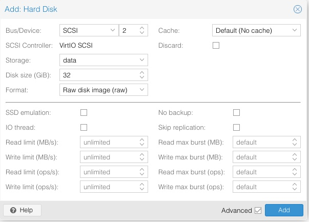

# Add a disk to a proxmox VM

### Step 1: add disk through proxmox web UI
  - vm -> Hardware -> Add -> Hard disk
  - 

### Step 2: Partition the disk
  - SSH into the server
  - `sudo fdisk -l` to list the drives. The one just created should be on the bottom. In this case it is /dev/sdb
```
    darrenj@build1:~$ sudo fdisk -l
    Disk /dev/sda: 32 GiB, 34359738368 bytes, 67108864 sectors
    Units: sectors of 1 * 512 = 512 bytes
    Sector size (logical/physical): 512 bytes / 512 bytes
    I/O size (minimum/optimal): 512 bytes / 512 bytes
    Disklabel type: dos
    Disk identifier: 0x72443e2a

    Device     Boot Start      End  Sectors Size Id Type
    /dev/sda1  *     2048 67106815 67104768  32G 83 Linux


    Disk /dev/sdb: 24 GiB, 25769803776 bytes, 50331648 sectors
    Units: sectors of 1 * 512 = 512 bytes
    Sector size (logical/physical): 512 bytes / 512 bytes
    I/O size (minimum/optimal): 512 bytes / 512 bytes
```
Create a new partition with `sudo fdisk /dev/sdb`. And remember to use 'w' to write when done
```
    darrenj@build1:~$ sudo fdisk /dev/sdb

    Welcome to fdisk (util-linux 2.31.1).
    Changes will remain in memory only, until you decide to write them.
    Be careful before using the write command.

    Device does not contain a recognized partition table.
    Created a new DOS disklabel with disk identifier 0x330c1d09.

    Command (m for help): n
    Partition type
    p   primary (0 primary, 0 extended, 4 free)
    e   extended (container for logical partitions)
    Select (default p):

    Using default response p.
    Partition number (1-4, default 1):
    First sector (2048-50331647, default 2048):
    Last sector, +sectors or +size{K,M,G,T,P} (2048-50331647, default 50331647):

    Created a new partition 1 of type 'Linux' and of size 24 GiB.

    Command (m for help): w
    The partition table has been altered.
    Calling ioctl() to re-read partition table.
    Syncing disks.
```
Now when you run `sudo fdisk -l` you will see the new partition.
```
    Disk /dev/sdb: 24 GiB, 25769803776 bytes, 50331648 sectors
    Units: sectors of 1 * 512 = 512 bytes
    Sector size (logical/physical): 512 bytes / 512 bytes
    I/O size (minimum/optimal): 512 bytes / 512 bytes
    Disklabel type: dos
    Disk identifier: 0x330c1d09

    Device     Boot Start      End  Sectors Size Id Type
    /dev/sdb1        2048 50331647 50329600  24G 83 Linux
```

### Step 3: Format the disk
  - `sudo mkfs.xfs /dev/sdb1` (To make ext4 partition, use `mkfs.ext4` etc. Check [manpage](https://linux.die.net/man/8/mkfs)
```
    darrenj@build1:~$ sudo mkfs.xfs /dev/sdb1
    meta-data=/dev/sdb1              isize=512    agcount=4, agsize=1572800 blks
            =                       sectsz=512   attr=2, projid32bit=1
            =                       crc=1        finobt=1, sparse=0, rmapbt=0, reflink=0
    data    =                       bsize=4096   blocks=6291200, imaxpct=25
            =                       sunit=0      swidth=0 blks
    naming  =version 2              bsize=4096   ascii-ci=0 ftype=1
    log     =internal log           bsize=4096   blocks=3071, version=2
            =                       sectsz=512   sunit=0 blks, lazy-count=1
    realtime =none                   extsz=4096   blocks=0, rtextents=0
```

### Step 4: Add entry into fstab and mount
- We will mount disk this into /data
- Make a directory at /data: `sudo mkdir /data`
- Add the following line to the bottom of /etc/fstab
  - `/dev/sdb1 /data xfs defaults 0 0`
- Mount the drive: `sudo mount /data`
- Now you can use the drive and it will remount when the vm is rebooted
```
darrenj@build1:/$ df -h
Filesystem      Size  Used Avail Use% Mounted on
udev            3.9G     0  3.9G   0% /dev
tmpfs           798M  720K  797M   1% /run
/dev/sda1        32G   11G   20G  34% /
tmpfs           3.9G     0  3.9G   0% /dev/shm
tmpfs           5.0M     0  5.0M   0% /run/lock
tmpfs           3.9G     0  3.9G   0% /sys/fs/cgroup
tmpfs           798M     0  798M   0% /run/user/1005
/dev/sdb1        24G   57M   24G   1% /data
```
