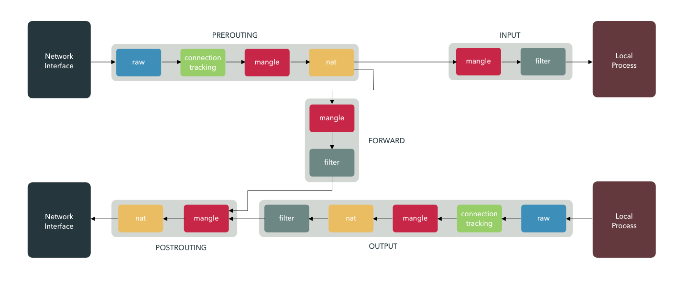

# Install `iptables`

`iptables` is the built-in firewall on Ubuntu, Debian and CentOS.

Heres a handy diagram to understand how it works:



Each colored box is a _table_, each gray box is a _chain_.

> When messing with IPTables configuration, it's a good idea to stop the `fail2ban` service or you may find yourself locked out.

## Ubuntu/Debian

`iptables` is installed by default. `iptables` do not persist on Ubuntu by default! You **must** add a persistence mechanism as an extra step.

Remove any old mechanism for persistences:

```sh
apt remove iptables-persistent netfilter-persistent
```

Copy the rules to `/etc/iptables.rules`, then:

```bash
sudo vi /etc/systemd/system/iptables-restore.service
```

And add:

```service
[Unit]
Description=Apply iptables rules

[Service]
Type=oneshot
ExecStart=/bin/sh -c 'iptables-restore /etc/iptables.rules'

[Install]
WantedBy=network-pre.target
```

Then `systemctl enable iptables-restore`.

## CentOS

`iptables` are persistent by default.

## Debugging

You can use:

```bash
sudo netstat -peanut
```

To see what ports are listening and the network activity that is occurring.

You can check IPTables when changing with:

```sh
iptables-restore --test
```

Debugging IPTables can be tricky.  To see each rule and how many times it has matched, do:

```sh
sudo iptables -L -v
```

## Commands

See [How to List and Delete iptables Rules](https://www.digitalocean.com/community/tutorials/how-to-list-and-delete-iptables-firewall-rules)

### Git Line Numbers

```sh
iptables -L --line-numbers
```

### Delete by Position

```sh
iptables -D $CHAIN $POS
```
