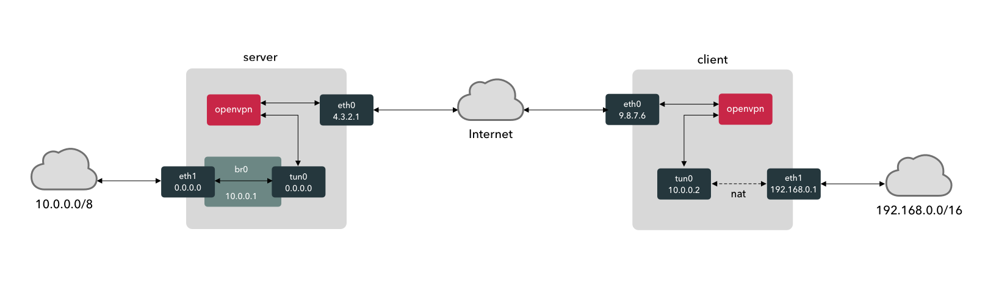

# Create Network Bridge with OpenVPN

## Overview

This guide will show you how to set up a VPN bridge using OpenVPN. In this configuration, we will connect to different subnets using a VPN server and client, as shown by the following diagram:



The server has two NIC's `eth0` connected to the Internet and `eth1` connected to the internal LAN. `eth1` is in promiscuous mode and is bridged (`br0`) to a tunnel interface (`tun0`) in and out of which the OpenVPN daemon receives and injects packets. The OpenVPN daemon connects to the Internet via `eth0`, sending encrypted data via UDP to the client.

The client receives packets on it's Internet NIC, `eth0` and passes packets to OpenVPN, which decrypts them and injects them into another tunnel device (`tun0`). This tunnel is dynamically assigned an IP address from the servers subnet, connecting it to the 10.0.0.0/8 subnet. The client also has an LAN facing NIC `eth1`. In order to get packets over from one subnet to the other they must be routed using Network Address Translation (NAT) using the `iptables` service.

## Installing the Server

Asssuming you have a machine with Ubuntu installed, it's a good idea to install the `nat` service to synchronize the system clock. You may also want to lock down the machine and configure `ssh` as you wish. This is outside the scope of these instructions.

Ensure that the system does not use DHCP to assign an IP address to the LAN side `eth1`. Check in `/etc/netplan/50-cloud-init.yaml` and check that `dhcp4: false` is set for the interface.

Then, install the bridging utilities, the `iptables` persistence packages, OpenVPN and certificates:

```bash
sudo -s
apt update
apt autoremove
apt install -y bridge-utils iptables-persistent openvpn openssl ca-certificates
```

Next, you need to configure the system to allow `iptables` to forward packets between interfaces on the system. Edit the file `/etc/sysctl.conf` and uncomment or add the line:

```conf
net.ipv4.ip_forward=1
```

This will make forwarding permanent. Then:

```bash
sudo sysctl -p /etc/sysctl.conf
```

To enable it.

Now, we'll create all the needed `iptables` rules at once. Some of these entries aren't needed until we have installed the bridge & tunnel later, but adding them now won't hurt:

```bash
echo "*filter
:INPUT ACCEPT [0:0]
:FORWARD ACCEPT [0:0]
:OUTPUT ACCEPT [0:0]
-A INPUT -m state --state RELATED,ESTABLISHED -j ACCEPT
-A INPUT -p icmp -j ACCEPT
-A INPUT -i lo -j ACCEPT
-A INPUT -s 10.10.0.0/8 -p tcp -m state --state NEW -m tcp --dport 22 -j ACCEPT
-A INPUT -s 9.8.7.6 -p udp -m state --state NEW -m udp --dport 1194 -j ACCEPT
-A INPUT -i tap0 -j ACCEPT
-A INPUT -i br0 -j ACCEPT
-A INPUT -j DROP
-A FORWARD -i br0 -j ACCEPT
-A FORWARD -j DROP
COMMIT" > /etc/iptables/rules.v4
iptables-restore < /etc/iptables/rules.v4
```

These rules allow traffic in from the LAN on port 22 (for `ssh`), and from port 1194 for OpenVPN. They also allow packets to forward to and from the bridge `br0`.

Now install EasyRSA and finish the OpenVPN configuration using the recommended based UDP protocol configuration:

```bash
cd ~
wget https://github.com/OpenVPN/easy-rsa/releases/download/v3.0.6/EasyRSA-unix-v3.0.6.tgz
tar xzf EasyRSA-unix-v3.0.6.tgz -C ~/
mv EasyRSA-v3.0.6 /etc/openvpn/easy-rsa
rm -f EasyRSA*.tgz
cd /etc/openvpn
chown -R root:root easy-rsa
cd easy-rsa
./easyrsa init-pki
./easyrsa --batch build-ca nopass
EASYRSA_CERT_EXPIRE=3650 ./easyrsa build-server-full server nopass
EASYRSA_CRL_DAYS=3650 ./easyrsa gen-crl
cp pki/ca.crt pki/private/ca.key pki/issued/server.crt pki/private/server.key pki/crl.pem /etc/openvpn
cd ..
chown nobody:nogroup crl.pem
openvpn --genkey --secret ta.key
echo "----BEGIN DH PARAMETERS-----
MIIBCAKCAQEA//////////+t+FRYortKmq/cViAnPTzx2LnFg84tNpWp4TZBFGQz
+8yTnc4kmz75fS/jY2MMddj2gbICrsRhetPfHtXV/WVhJDP1H18GbtCFY2VVPe0a
87VXE15/V8k1mE8McODmi3fipona8+/och3xWKE2rec1MKzKT0g6eXq8CrGCsyT7
YdEIqUuyyOP7uWrat2DX9GgdT0Kj3jlN9K5W7edjcrsZCwenyO4KbXCeAvzhzffi
7MA0BM0oNC9hkXL+nOmFg/+OTxIy7vKBg8P+OxtMb61zO7X8vC7CIAXFjvGDfRaD
ssbzSibBsu/6iGtCOGEoXJf//////////wIBAg==
-----END DH PARAMETERS-----" > dh.pem
echo "port 1194
proto udp
dev tap0
sndbuf 0
rcvbuf 0
ca ca.crt
cert server.crt
key server.key
dh dh.pem
auth SHA512
tls-auth ta.key 0
topology subnet
server-bridge 10.0.0.1 255.0.0.0 10.0.0.2 10.0.0.2
ifconfig-pool-persist ipp.txt" > server.conf
```

The values of `server-bridge` are a free IP address LAN, the subnet mask and the private IP range for clients, lower and upper IP addresses.

Next, create the common client configuration:

```bash
echo "client
dev tap0
proto udp
sndbuf 0
rcvbuf 0
remote 4.3.2.1 1194
resolv-retry infinite
nobind
persist-key
persist-tun
remote-cert-tls server
auth SHA512
cipher AES-256-CBC
setenv opt block-outside-dns
key-direction 1
verb 3" > /etc/openvpn/client-common.txt
```

Now create a script to generate client configuration and certificates:

```bash
echo '#!/bin/bash
EASYRSA_CERT_EXPIRE=3650 /etc/openvpn/easyrsa build-client-full $1 nopass
OVPN_FILE=$HOME/$1.ovpn
CRT_FILE=/etc/openvpn/easy-rsa/pki/issued/$1.crt
cp /etc/openvpn/client-common.txt $OVPN_FILE
echo "<ca>" >> $OVPN_FILE
cat /etc/openvpn/easy-rsa/pki/ca.crt >> $OVPN_FILE
echo "</ca>" >> $OVPN_FILE
echo "<cert>" >> $OVPN_FILE
sed -ne '/BEGIN CERTIFICATE/,$ p' /etc/openvpn/easy-rsa/pki/issued/$1.crt >> $OVPN_FILE
echo "</cert>" >> $OVPN_FILE
echo "<key>" >> $OVPN_FILE
cat /etc/openvpn/easy-rsa/pki/private/$1.key >> $OVPN_FILE
echo "</key>" >> $OVPN_FILE
echo "<tls-auth>" >> $OVPN_FILE
sed -ne "/BEGIN OpenVPN Static key/,$ p" /etc/openvpn/ta.key >> $OVPN_FILE
echo "</tls-auth>" >> $OVPN_FILE' > /etc/openvpn/create-client
chmod u+x /etc/openvpn/create-client
```

Generate a client configuration now, e.g. `./create-client client01`.

Now create `br0`, `tap0` and set both `tap0` and `eth1` into promiscuous mode to collect all packets:

```bash
echo "#!/bin/bash
openvpn --mktun --dev tap0
brctl addbr br0
brctl addif br0 eth1
brctl addif br0 tap0
ifconfig tap0 0.0.0.0 promisc up
ifconfig eth1 0.0.0.0 promisc up
ifconfig br0 10.0.0.1 netmask 255.0.0.0 broadcast 10.255.255.255" > /etc/openvpn/start-bridge
chmod u+x /etc/openvpn/start-bridge
```

And, should you need it, here's a script to delete the bridge:

```bash
echo "#!/bin/bash
ifconfig br0 down
brctl delbr br0
openvpn --rmtun --dev tap0" > /etc/openvpn/stop-bridge
chmod u+x /etc/openvpn/stop-bridge
```

Check the OpenVPN service start cleanly with `openvpn server.conf`. If all is well,

```bash
systemctl start openvpn@server
systemctl enable openvpn@server
```

## Installing the Client

Configuration of each client machine is simpler. First, install pre-requisites:

```bash
sudo -s
apt update
apt autoremove
apt install -y bridge-utils iptables-persistent openvpn openssl ca-certificates
```

Configure the client `iptables`, something like this:

```bash
echo "*filter
:INPUT ACCEPT [0:0]
:FORWARD ACCEPT [0:0]
:OUTPUT ACCEPT [0:0]
-A INPUT -m state --state RELATED,ESTABLISHED -j ACCEPT
-A INPUT -p icmp -j ACCEPT
-A INPUT -i lo -j ACCEPT
-A INPUT -s 192.168.0.0/8 -p tcp -m state --state NEW -m tcp --dport 22 -j ACCEPT
-A INPUT -s 4.3.2.1 -p udp -m state --state NEW -m udp --dport 1194 -j ACCEPT
-A INPUT -i tap0 -j ACCEPT
-A INPUT -j DROP
COMMIT" > /etc/iptables/rules.v4
iptables-restore < /etc/iptables/rules.v4
```

Grab the file `$HOME/client01.ovpn` from the server. Copy it to `/etc/openvpn/client.conf`.

Test that OpenVPN starts and connects to the server with `openvpn client.conf`.

Now start it permanently with:

```bash
systemctl start openvpn@client
systemctl enable openvpn@client
```

## References

[Bridged OpenVPN Server Setup](https://www.emaculation.com/doku.php/bridged_openvpn_server_setup)
