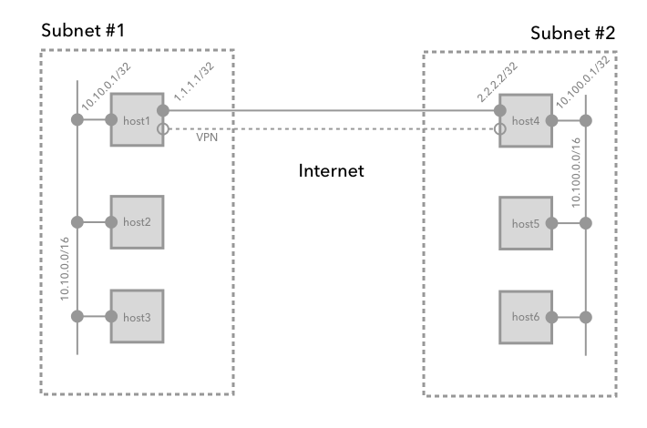

# Configure Strongswan Site-to-Site Connection

## The Goal

We want to join two subnets together across the Internet so that all machines in each subnet can see and connect to all the other machines. In each subnet we assume:

- Both subnets have non-ovehrlapping IP address ranges
- One machine is connected to the Internet and has a static IP address
- That machine has a `iptables` (Netfilter) based firewall
- We are using the Strongswan IPSec VPN software
- Machines in both subnets are a mixture of Ubuntu 19 and CentOS 7

In order to do this we need to configure:

- Strongswan
- Netplan routing tables
- IPTables rules

Note that this is possible to do without use of network address translation (NAT)

Refer to the following diagram for the various subnets, IP addresses and host names in the following explanation.



## Configuring Strongswan

First we must connect the two subnets using IKEv2/IPSec via Strongswan.  Not that Strongswan is just a program for IKEv2 key exchange. Once a secure connection is established with IKEv2 the actual data transfer is performed by Charon process which is part of the Linux kernel.  We will use the [Encapsulating Security Payload (ESP)](http://networksorcery.com/enp/protocol/esp.htm) mechanism in tunnel mode (vs. transport mode).  See [this IBM article](https://www.ibm.com/support/knowledgecenter/en/SSLTBW_2.3.0/com.ibm.zos.v2r3.halz002/ipsecurity_ipsec_ah_esp_encap_modes.htm) for more information.

IPSec is different from the OpenVPN software in that it does not create virtual network devices. Instead it adds virtual IP's to existing network interfaces, intercepting packets in the kernel and encrypting them.  This can make understanding the interaction with the Netfilter firewall challenging. The main things to understand are that packets destined for the VPN tunnel will generally traverse the firewall rules at least twice, once from the initial interaction, and the second time as encrypted ESP packets.

Assuming Strongswan is installed an running on your system, add a `site2site` connection in the `/etc/ipsec.conf` file on `host1`:

```conf
config setup

conn site2site
  ikelifetime=60m
  keylife=20m
  rekeymargin=3m
  keyingtries=1
  authby=secret
  keyexchange=ikev2
  mobike=no
  authby=secret
  left=1.1.1.1
  leftsubnet=10.10.0.0/16
  leftfirewall=yes
  right=2.2.2.2
  rightsubnet=10.100.0.0/16
  ike=aes256-sha2_256-modp2048!
  esp=aes256-sha2_256!
  auto=start
```

And for `host4`:

```conf
config setup

conn site2site
  ikelifetime=60m
  keylife=20m
  rekeymargin=3m
  keyingtries=1
  authby=secret
  keyexchange=ikev2
  mobike=no
  authby=secret
  left=2.2.2.2
  leftsubnet=10.10.0.0/16
  leftfirewall=yes
  right=2.2.2.2
  rightsubnet=10.100.0.0/16
  ike=aes256-sha2_256-modp2048!
  esp=aes256-sha2_256!
  auto=start
```

Note in each configuration, left is the host and right is the other side of the connection.

Then, generate a unique Pre-Shared Key (PSK) value:

```sh
openssl rand -base64 64 | tr -d '=\n'
```

Let's say it's `HIvPXzYPDZiQX5vEp/0ASsITuv173ZZ9cVnYD39wxJYfFLwRbyQuWOdEG1UvWxDqs5zmGyScJ5DVj+EE/s/8eA` On both `host1` edit `/etc/ipsec.secrets` to contain:

```conf
1.1.1.1 2.2.2.2 : PSK "HIvPXzYPDZiQX5vEp/0ASsITuv173ZZ9cVnYD39wxJYfFLwRbyQuWOdEG1UvWxDqs5zmGyScJ5DVj+EE/s/8eA"
```

and on `host4`:

```conf
2.2.2.2 1.1.1.1 : PSK "HIvPXzYPDZiQX5vEp/0ASsITuv173ZZ9cVnYD39wxJYfFLwRbyQuWOdEG1UvWxDqs5zmGyScJ5DVj+EE/s/8eA"
```

## Configuring IPTables rules

First, make sure that your `/etc/sysctl.conf` contain `net.ipv4.ip_forward=1` or nothing will work.

Next, we assume you already have a bunch of firewall rules.  You need to add the following around them:

```rules
...
# Allow established traffic
-A INPUT -m state --state RELATED,ESTABLISHED -j ACCEPT
-A INPUT -m state --state INVALID -j DROP

# Allow incoming pings (for debugging)
-A INPUT -p icmp -m icmp --icmp-type 3 -j ACCEPT
-A INPUT -p icmp -m icmp --icmp-type 8 -j ACCEPT
-A INPUT -p icmp -m icmp --icmp-type 11 -j ACCEPT
-A INPUT -p icmp -m icmp --icmp-type 12 -j ACCEPT

# Allow IKEv2 and IPSec (ESP) traffic out to the other host
-A INPUT -i wan0 -p udp -m udp --dport 500 -j ACCEPT
-A INPUT -i wan0 -p udp -m udp --dport 4500 -j ACCEPT
-A INPUT -s 2.2.2.2/32 -i enp0s9 -p esp -j ACCEPT
...
# Allow outgoing pings (for debugging)
-A OUTPUT -p icmp -m icmp --icmp-type 3 -j ACCEPT
-A OUTPUT -p icmp -m icmp --icmp-type 8 -j ACCEPT
-A OUTPUT -p icmp -m icmp --icmp-type 11 -j ACCEPT
-A OUTPUT -p icmp -m icmp --icmp-type 12 -j ACCEPT

# Allow IKEv2 and IPSec (ESP) traffic in from the other host
-A OUTPUT -d 2.2.2.2/32 -o wan0 -p udp -m udp --dport 500 -j ACCEPT
-A OUTPUT -d 2.2.2.2/32 -o wan0 -p udp -m udp --dport 4500 -j ACCEPT
-A OUTPUT -d 2.2.2.2/32 -o wan0 -p esp -j ACCEPT
...
```

Where `wan0` is the NIC connected to the Internet.

## Configuring Routing tables

The last thing to configure is the system routing tables.  On `host1` you need a route that sends `10.100.0.0/16` traffic to the `1.1.1.1` where Charon will intercept it, encrypt it and send it over to `2.2.2.2`/`host4`.

You can add this rule quickly with:

```sh
ip route add 10.100.0.0/16 via 1.1.1.1 dev wan0
```

But this will go away when you reboot. Better to add it directly to the Netplan file at `/etc/netplan/50-cloud-init.yaml` as follows:

```yaml
network:
    ethernets:
        lan0:
            dhcp4: true
        wan0:
            dhcp4: false
            addresses: [10.100.0.1/16]
            routes:
            - to: 10.10.0.0/16
              via: 2.2.2.2
    version: 2
```

On other machines in the same subnet, you need to send the packets to the host that is doing the VPN, like this:

```yaml
network:
    ethernets:
        lan0:
            dhcp4: false
            addresses: [10.100.0.2/16]
            routes:
            - to: 10.100.0.0/16
              via: 10.100.0.1
    version: 2
```

Where `10.100.0.1` is the internal IP of `host1` and `10.100.0.2` is the IP of a specific machine.

Furthermore, if you are using DHCP, you should configure the routes into the DHCP server.  This is beyond the scope of this article as it depends on your DHCP server.

## Testing

Once all the above is configure, restart your network, then Strongswan:

```bash
sudo netplan apply
sudo systemctl restart strongswan
```

Do the following on `host4`:

```bash
sudo tcpdump -i wan0 esp
```

Then on a machine in the `host1` network:

```bash
ping 10.10.0.1
```

You should get ping responses and see the ESP packets arriving at `host4`.
