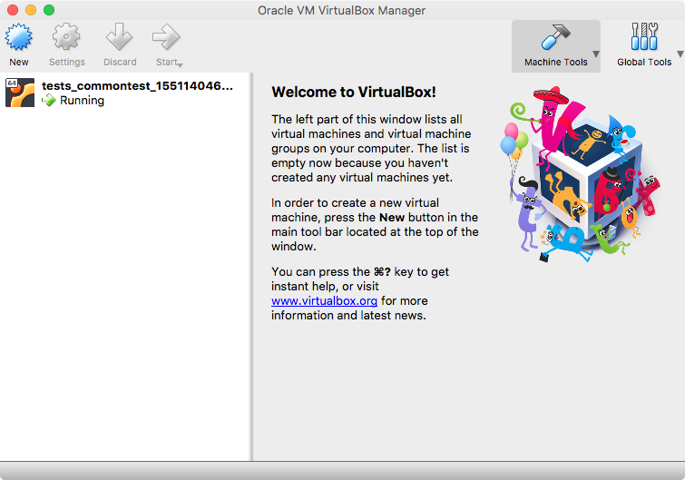

# Using Virtualbox and Vagrant to create a local vm
### What is it?
* VirtualBox is a free and open-source hosted hypervisor for x86 computers 
* Vagrant is a tool for building and managing virtual machine environments in a single workflow.
* When used together, it is a solution to quickly create locally hosted virtual machines for testing.

### Installation 
* __VirtualBox__
    * Can be installed with Homebrew
    * ```brew cask install virtualbox```
  
* __Vagrant__
    * Can be downloaded from the hashicorp site
    * ```https://www.vagrantup.com/downloads.html```

### Creating an Ubuntu 18.04 Virtual Machine

#### Configuration
Once both VirtualBox and Vagrant are installed, create a new directory, and make a new file named ```hosts```
```
# ports:  see Vagrantfile
local_test ansible_host=127.0.0.1 ansible_port=13122

[test]
local_test
```
__Note:__ you can create several local vms by adding another line in the hosts file using the same IP, but a different port and name.


Now create the following file called ```Vagrant```
```
VAGRANTFILE_API_VERSION = '2'

Vagrant.configure(VAGRANTFILE_API_VERSION) do |config|
  config.vm.box = "bento/ubuntu-18.04"
  config.vm.network :private_network, type: 'dhcp'
  # use the same private key on all VMs
  config.ssh.insert_key = false

  config.vm.define "localtest" do |localtest|
    localtest.vm.hostname = "localtest"
    localtest.vm.network :forwarded_port, guest: 22, host: 13122, id: 'ssh'
  end

end
```
__Note:__ If you created multiple vms in the ```hosts``` file, add a block for each in the ```Vagrant``` file.

#### Starting
* Start the virtual machine using the command ```vagrant up```. If this is the first time, vagrant will download the Ubuntu 18.04 image file.
```
Darrens-MacBook-Pro@~/projects/darrenj/devops/roles/common/tests> vagrant up
Bringing machine 'commontest' up with 'virtualbox' provider...
==> commontest: Importing base box 'bento/ubuntu-18.04'...
==> commontest: Matching MAC address for NAT networking...
==> commontest: Checking if box 'bento/ubuntu-18.04' is up to date...
==> commontest: Setting the name of the VM: tests_commontest_1551140467202_9965
==> commontest: Clearing any previously set network interfaces...
==> commontest: Preparing network interfaces based on configuration...
    commontest: Adapter 1: nat
    commontest: Adapter 2: hostonly
==> commontest: Forwarding ports...
    commontest: 22 (guest) => 13122 (host) (adapter 1)
==> commontest: Booting VM...
==> commontest: Waiting for machine to boot. This may take a few minutes...
    commontest: SSH address: 127.0.0.1:13122
    commontest: SSH username: vagrant
    commontest: SSH auth method: private key
==> commontest: Machine booted and ready!
==> commontest: Checking for guest additions in VM...
==> commontest: Setting hostname...
==> commontest: Configuring and enabling network interfaces...
==> commontest: Mounting shared folders...
    commontest: /vagrant => /Users/darrenjeung/projects/darrenj/devops/roles/common/tests
```
If you open the VirtualBox console, you will see the VM now.


#### Connecting
* __SSH__: from the same directory using ```vagrant ssh``` will log you in as vagrant user with sudo.
* __Ansible__: Vagrant creates an insecure private key at: ```~/.vagrant.d/insecure_private_key```
You can make your ```ansible.cfg``` file look like this:
```
[defaults]
inventory=hosts
remote_user=vagrant
private_key_file = ~/.vagrant.d/insecure_private_key
host_key_checking = False
```