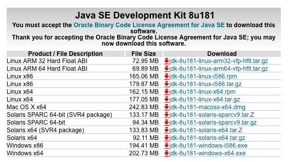

# macOS Developer System Setup

These instructions assume a clean installation of macOS (at least High Sierra or above) and that you are logged on as an administrator user, i.e. you can run `sudo`.

## General

Go to your `$HOME` directory and do `mkdir bin`.

Note, you can create a `scratch` directory anywhere in your source tree and any files in those directories will not be committed.

## Install iTerm2

Download and install [iTerm2](https://www.iterm2.com/). Open _Preferences_ and duplicate the default profile:


Set the _Working Directory_ to _Reuse previous session directory_.

Go to the _Keys_ tab. Delete all key shortcuts, and add two for **&#8997; &#8592;** and **&#8997; &#8594;** as shown.


Select _Send Escape Sequence_ from the really long drop-down menu, and the type `b` or `f`.

## Install Homebrew

_NOTE: Be careful!!! There is a Trojan Horse site parked at `http://homebrew.sh` that looks like the Homebrew site but which actually attempts to install malware._

Go to [Homebrew](https://brew.sh), copy the line and run it:


Run `brew doctor` and _fix all the problems that it tells you about_. One of the issues will probably be installation of Xcode (see below)

NOTE: You do not need or want to be `sudo` when you install Homebrew. If you have installed Homebrew with `sudo`, uninstall it and re-install as yourself.

## Install Visual Studio code

Download [Visual Studio Code](https://code.visualstudio.com/download) and install to _Applications_.

Run it, type **&#8984; Shift P** then search for and run "Shell command: Install 'code' command in PATH".

Install the packages:

- [Prettier](https://marketplace.visualstudio.com/items?itemName=esbenp.prettier-vscode)
- [Toggle Quotes](https://marketplace.visualstudio.com/items?itemName=BriteSnow.vscode-toggle-quotes)
- [JSON5 Syntaxt](https://marketplace.visualstudio.com/items?itemName=mrmlnc.vscode-json5)
- [Property List](https://marketplace.visualstudio.com/items?itemName=zhouronghui.propertylist)

Override the default `keybindings.json` file with:

```json
[
  {
    "key": "shift+alt+cmd+f",
    "command": "workbench.action.replaceInFiles"
  },
  {
    "key": "shift+cmd+h",
    "command": "-workbench.action.replaceInFiles"
  }
]
```

Add the following settings:

```
{
    "window.zoomLevel": 0,
    "javascript.implicitProjectConfig.experimentalDecorators": true,
    "editor.minimap.enabled": false,
    "explorer.confirmDragAndDrop": false,
    "files.trimTrailingWhitespace": true,
    "editor.tabSize": 2,
    "workbench.startupEditor": "newUntitledFile",
    "extensions.ignoreRecommendations": true,
    "explorer.confirmDelete": false,
    "editor.formatOnSave": false,
    "[javascript]": {
        "editor.formatOnSave": true
    },
    "[json]": {
        "editor.autoIndent": false
    },
    "javascript.updateImportsOnFileMove.enabled": "never",
    "breadcrumbs.enabled": true
}
```

## Install git

Do `brew install git`.

Edit the global config with `git config --edit --global` (which will open the file in `vi`). Go to a point in the file, type `i` to insert then paste:

```ini
[user]
  name = Your Name
  email = you@your-company.com

[core]
  editor = /usr/local/bin/code -w
  autocrlf = false
  excludesfile = /Users/you/.gitignore_global

[alias]
  ada = add -A :/
  st = status -sb
  sta = status -sb
  com = commit
  bra = branch
  chk = checkout
  dto = difftool
  mto = mergetool
  mrg = merge
  log = log -p
  sub = submodule
  fch = fetch -v
  rem = remote
  psh = push
  pll = pull
  ash = stash
  cfg = config
  chp = cherry-pick
  lst = ls-tree -r --name-only
  prq = pull-request
  brw = browse
  reb = rebase
  rst = reset
  upr = !git fetch upstream && git rebase upstream/master
  upm = !git fetch upstream && git merge upstream/master
```

Copy git prompt and completion scripts to `~/bin`:

- [`git-completion.sh`](https://github.com/git/git/blob/master/contrib/completion/git-completion.bash)
- [`git-prompt.sh`](https://github.com/git/git/blob/master/contrib/completion/git-prompt.sh)

See the section below on setting up Bash for how to install and use these.

## Install Ruby

Install [rbenv](https://github.com/rbenv/rbenv) with `homebrew install rbenv`.

Install a specific version of Ruby, say `rbenv install 2.3.7` then switch the system version over to it, `rbenv global 2.3.7`.

## Install Node.js

`brew install node`. Ensure that `npm` is up-to-date with `npm i -g npm`.

## Install readline

`brew install readline rlwrap` (which helps to fix Node.js REPL coloring issues)

## Bash Setup

Setup your `bash` environment correctly first! Create a `~/.bash_profile` file that contains just this:

```bash
# The personal initialization file, executed for login shells
[[ -r ~/.bashrc ]] && source ~/.bashrc
```

Then create a `~/.bashrc` file that contains:

```
# The individual per-interactive-shell startup file

# Git prompt and completion scripts
source ~/bin/git-prompt.sh
source ~/bin/git-completion.sh

GIT_PS1_SHOWDIRTYSTATE=1
GIT_PS1_SHOWUNTRACKEDFILES=1
GIT_PS1_SHOWUPSTREAM=1
GIT_PS1_SHOWCOLORHINTS=1

export PS1=''
export PROMPT_COMMAND='__git_ps1 "[\u@\h:\w" "]\n\$"'
export EDITOR='code -w'
export CLICOLOR=1
export LSCOLORS=GxFxCxDxBxegedabagaced

# function for setting terminal titles, e.g. title server
function title {
  printf "\x1b]0;%s\x7" "$1"
}

# function for setting iTerm2 tab colors, e.g. tab-color 255 100 255
function tab-color {
  printf "\x1b]6;1;bg;red;brightness;%s\x7" "$1"
  printf "\x1b]6;1;bg;green;brightness;%s\x7" "$2"
  printf "\x1b]6;1;bg;blue;brightness;%s\x7" "$3"
}

# Android SDK
export ANDROID_HOME="$HOME/Library/Android/sdk"
export PATH="$PATH:$ANDROID_HOME/emulator"
export PATH="$PATH:$ANDROID_HOME/tools"
export PATH="$PATH:$ANDROID_HOME/platform-tools"

# Get IP address
export LOCAL_IP_ADDR=$(ipconfig getifaddr en0)

alias edit="code"
alias bn="babel-node"
alias an="ansible"
alias ap="ansible-playbook"
alias mq=rabbitmqctl
alias node=alias node="NODE_NO_READLINE=1 rlwrap -pcyan node"

if which rbenv > /dev/null; then
    eval "$(rbenv init -)"
fi

# Java
export JAVA_HOME=$(/usr/libexec/java_home)

# Brew
export PATH="$HOME/bin:$PATH:/usr/local/share/npm/bin:/usr/local/sbin"

# Tcl/Tk
export PATH="/usr/local/opt/tcl-tk/bin:$PATH"
```

## Install SuperDuper!

Install the [SuperDuper!](https://www.shirt-pocket.com/SuperDuper/SuperDuperDescription.html) software. This is the software we use for back-ups.

## Install ClamXAV

Install [ClamXAV](https://www.clamxav.com/) virus checker. This is required for PCI compliance.

## Install Xcode

Install [Xcode](https://itunes.apple.com/us/app/xcode/id497799835?mt=12) from the App Store.

Run Xcode after it downloads, and wait for it to initialize. Then run the following on the command line:

```
xcode-select --install
```

to install the command line tools. You can also run `brew doctor` which will tell you how to do this also.

## Install SourceTree

Go to [SourceTree](https://www.sourcetreeapp.com/) and download the installer. Copy to _Applications_.

To install the command line tools, don't use the link in the app, because it assumes that the `sudo` user owns the `/usr/local/bin` directory. Instead run:

```
ln -s /Applications/SourceTree.app/Contents/Resources/stree /usr/local/bin/
```

## Install image libraries

`brew install pkg-config cairo libpng jpeg giflib` to support using the [canvas](https://www.npmjs.com/package/canvas) library.

## Install Java

Install [Java](http://www.oracle.com/technetwork/java/javase/downloads/index.html) by downloading the appropriate installer:



## Install Ansible

`brew install ansible`

## Install RabbitMQ

`brew install rabbitmq` then `brew services start rabbitmq`

## Install Redis

`brew install redis` then `brew services start redis`

## Install MongoDB

`brew install mongodb` then `brew services start mongodb`

## Install nginx

`brew install nginx` then `brew services start nginx`

## Install PostgreSQL

`brew install postgresql` then `brew services start postgresql`

## Install Node.js

Do `npm install -g snap-tool stampver monzilla babel-cli jest`

To support Node.js development.

## Install consul

We use consul in production for dynamic configuration of the backend cluster.

First, install `consul`:

```
brew install consul
```

Then, edit the `.plist` file that is installed, `edit /usr/local/Cellar/consul/1.2.3/homebrew.mxcl.consul.plist` to contain:

```plist
<?xml version="1.0" encoding="UTF-8"?>
<!DOCTYPE plist PUBLIC "-//Apple//DTD PLIST 1.0//EN" "http://www.apple.com/DTDs/PropertyList-1.0.dtd">
<plist version="1.0">
  <dict>
    <key>KeepAlive</key>
    <dict>
      <key>SuccessfulExit</key>
      <false/>
    </dict>
    <key>Label</key>
    <string>homebrew.mxcl.consul</string>
    <key>ProgramArguments</key>
    <array>
      <string>/usr/local/opt/consul/bin/consul</string>
      <string>agent</string>
      <string>-server</string>
      <string>-bind</string>
      <string>127.0.0.1</string>
      <string>-bootstrap</string>
      <string>-data-dir</string>
      <string>/usr/local/var/consul</string>
    </array>
    <key>RunAtLoad</key>
    <true/>
    <key>WorkingDirectory</key>
    <string>/usr/local/var</string>
    <key>StandardErrorPath</key>
    <string>/usr/local/var/log/consul.log</string>
    <key>StandardOutPath</key>
    <string>/usr/local/var/log/consul.log</string>
  </dict>
</plist>
```

This will configure `consul` to persist key/value pairs locally, otherwise they will be lost on each system restart. Then `brew services start consul`.

## React Native

For React Native development:

```
npm react-native-cli watchman
`

## Install Sketch

Download and install [Bohemian Sketch](https://www.sketchapp.com/). Purchase or otherwise obtain a valid license key.

## Install Acorn

Download and install [Acorn](https://itunes.apple.com/us/app/acorn-6-image-editor/id1233861775?mt=12) from the App Store. Purchase or obtain a license key.
```
