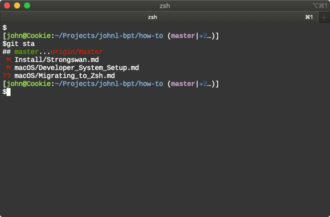

# Migrating to Zsh on macOS

## Basics

Start by renaming your Bash profile files:

```zsh
mv ~/.bash_profile ~/.zprofile
mv ~/.bashrc ~/.zshrc
```

## Git Prompt

To install a Git prompt, do the following:

```zsh
mkdir ~/.zsh
cd ~/.zsh
git clone git@github.com:jlyonsmith/zsh-git-prompt.git
```

Now, update your `~/.zshrc` file with the following:

```zsh
# Prompt
source ~/.zsh/zsh-git-prompt/zshrc.sh

export PROMPT='[%F{#99E343}%n@%m%f:%F{#83B0D8}%~%f$(git_super_status)]'$'\n''$'
export RPROMPT=''
```

It looks like this:



You can remove any old `git-prompt` commands.

## Oh-My-Zsh

If you want to try it out, [Oh-My-Zsh](https://github.com/robbyrussell/oh-my-zsh) is a source for endless shell tinkering. The most popular thing to do seems to be installing the [Powerline](https://github.com/powerline/fonts) fonts, then installing one of the insane [Zsh Themes](https://github.com/robbyrussell/oh-my-zsh/wiki/Themes) like [Agnoster](https://github.com/agnoster/agnoster-zsh-theme)
